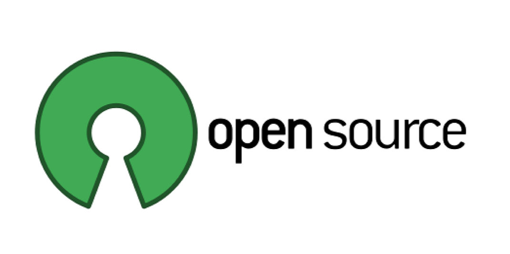

# Open-Source-for-All 👑

Are you a beginner who is looking to contribute to open-source projects 🚀? Then make your first PR from here! 🎉

## What is this?
This repository is for those who are getting started into the open-source world.
You can quickly make your first contribution in open-source and get a green square!
We will teach you step by step on how to make your first contribution in the open-source world 😎

## Step-by-step tutorial

### Step I: Fork the repository 

Fork this repository by clicking on the fork button on the top of this page. This will create a copy of this repository in your account.

### Step II: Clone the repository
Now clone the forked repository to your machine. Go to your GitHub account, open the forked repository, click on the code button and then click the copy button.
Open the terminal and run the following command:
```bash
git clone <paste your url>
```

### Step III: Create a New Branch:
cd into your new directory by
```bash
cd <repo-name>
```
Then, create a new branch
```bash
git switch -c <New-branch-name>
```
For example
```bash
git switch -c Addname
```

### Step IV: Commit necessary changes
Make all the necessary changes
#### What to contribute?
You can Add your GitHub username and link to the `PROFILES.md` file in the _alphabetic order_ or find typos in the documentation.
In the `PROFILES.md` file, do the following
```markdown
- [GitHub-username](GitHub-link) - <Your Bio>
```
Add those changes to the branch you just created using the `git add` command:
```bash
git add PROFILES.MD
```
Now commit those changes using `git commit` command:
```bash
git commit -am "Add name to profiles list"
```

### Step V: Push to GitHub
You can push those changes using the `git push` command:
```bash
git push origin -u <your branch name>
```
You can find your current branch name that you made in the beginning using the command `git branch`

### Step VI: Submit for review
If you go to your repository on GitHub, you'll see a `Compare & pull request` button. Click on that button.


Then, you can submit the Pull request


## Contributing 

Contributions are always welcome!
Please adhere to this project's `code of conduct`.

## License

[MIT](https://choosealicense.com/licenses/mit/) &nbsp;
[](https://choosealicense.com/licenses/mit/)

